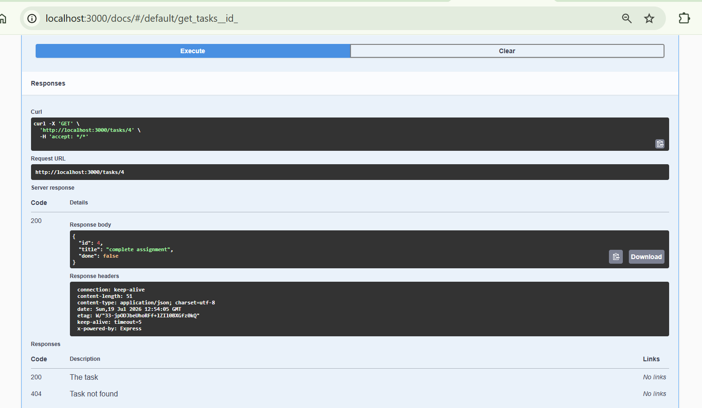

# Task API

A small in-memory to-do list API built with Node.js and Express — supports full CRUD (Create, Read, Update, Delete) on tasks, with interactive documentation via Swagger UI.

> Built for FlyRank Backend Track · Week 2 · Assignment A1

---

## What this is

A backend server that manages a to-do list. Tasks are stored **in memory only** (a plain JavaScript array) — there is no database yet, so all data resets whenever the server restarts. That's intentional at this stage; a real database arrives in Week 3.

Each task looks like this:

```json
{ "id": 1, "title": "Buy milk", "done": false }
```

---

## Tech stack

| Tool | Purpose |
|---|---|
| [Node.js](https://nodejs.org) | JavaScript runtime |
| [Express](https://expressjs.com) | Web framework — routing, JSON parsing |
| [swagger-ui-express](https://www.npmjs.com/package/swagger-ui-express) | Serves interactive API docs at `/docs` |

---

## Getting started

### Prerequisites
- Node.js 18+ installed (check with `node -v`)

### Install & run

```bash
git clone https://github.com/<your-username>/crud.git
cd crud
npm install
npm start
```

You should see:

```
Task API running at http://localhost:3000
Swagger docs at   http://localhost:3000/docs
```

Then open:
- **http://localhost:3000/** — API info
- **http://localhost:3000/docs** — interactive Swagger UI (try every endpoint without a terminal)

---

## Project structure

```
crud/
├── index.js          # server + all routes
├── openapi.json       # API spec that powers Swagger UI
├── package.json       # dependencies & scripts
├── package-lock.json  # exact dependency versions
├── .gitignore         # excludes node_modules
└── README.md          # this file
```

---

## API reference

| Method | Endpoint       | Description                          | Success | Errors |
|--------|----------------|---------------------------------------|---------|--------|
| GET    | `/`            | API name, version, and endpoint list  | `200`   | —      |
| GET    | `/health`      | Liveness check                        | `200`   | —      |
| GET    | `/tasks`       | List all tasks                        | `200`   | —      |
| GET    | `/tasks/:id`   | Get a single task by id                | `200`   | `404` if not found |
| POST   | `/tasks`       | Create a task — body: `{ "title": string }` | `201` | `400` if title missing/empty |
| PUT    | `/tasks/:id`   | Update `title` and/or `done`           | `200`   | `400` invalid body · `404` not found |
| DELETE | `/tasks/:id`   | Delete a task                          | `204`   | `404` if not found |

**Status codes used:** `200` OK · `201` Created · `204` No Content · `400` Bad Request · `404` Not Found.

---

## Trying it out

### Option A — Swagger UI (easiest)
Go to `http://localhost:3000/docs`, expand any endpoint, click **Try it out**, fill in the fields, and hit **Execute**.

### Option B — terminal (PowerShell)

```powershell
# Get the full list
curl.exe -i http://localhost:3000/tasks

# Get one task
curl.exe -i http://localhost:3000/tasks/1

# Create a task
Invoke-RestMethod -Uri http://localhost:3000/tasks -Method Post -ContentType "application/json" -Body '{"title":"Buy milk"}'

# Update a task
Invoke-RestMethod -Uri http://localhost:3000/tasks/1 -Method Put -ContentType "application/json" -Body '{"done":true}'

# Delete a task
curl.exe -i -X DELETE http://localhost:3000/tasks/1
```

### Example: real request/response

```
GET http://localhost:3000/tasks/4

HTTP/1.1 200 OK
Content-Type: application/json; charset=utf-8

{
  "id": 4,
  "title": "complete assignment",
  "done": false
}
```

<!-- Replace the block above with your own real curl -i / Invoke-RestMethod output -->

---

## Swagger UI




---

## The "mortality experiment"

Create a task, restart the server, then `GET /tasks` again — new task is gone; only the 3 seed tasks remain.

This happens because `tasks` is just a variable in memory — nothing is written to disk. Fixing this is exactly what a real database (coming in Week 3) is for.

---

## Development notes

This project was built incrementally, one stage at a time, each with its own commit:

| Stage | What was added |
|-------|-----------------|
| 0 | Bare Express server, no routes |
| 1 | `GET /` and `GET /health` |
| 2 | In-memory task list + `GET /tasks`, `GET /tasks/:id` (with 404s) |
| 3 | `POST /tasks` with validation |
| 4 | `PUT /tasks/:id` and `DELETE /tasks/:id` — full CRUD complete |
| 5 | `openapi.json` + Swagger UI at `/docs` |
| 6 | This README + public GitHub repo |

---


## License

MIT — built for educational purposes.