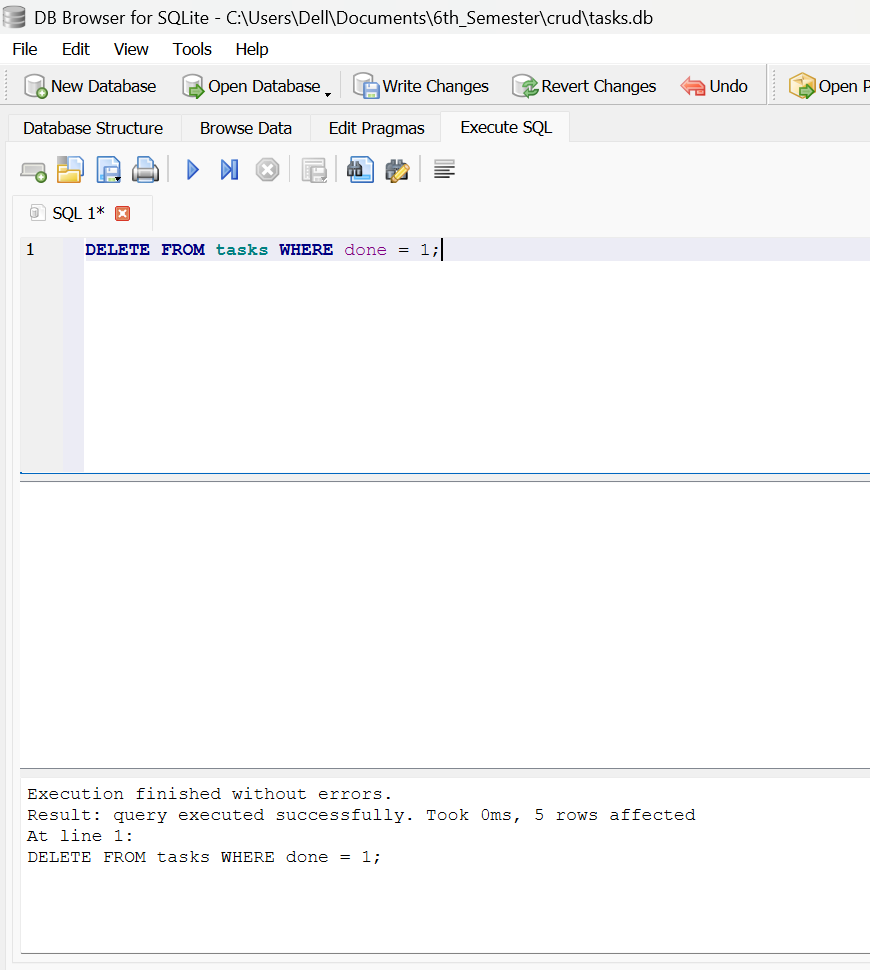
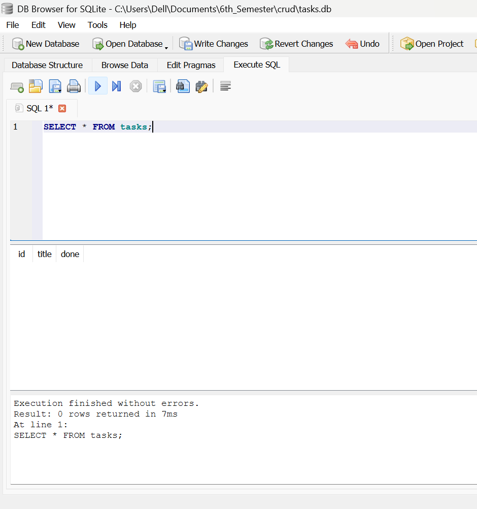
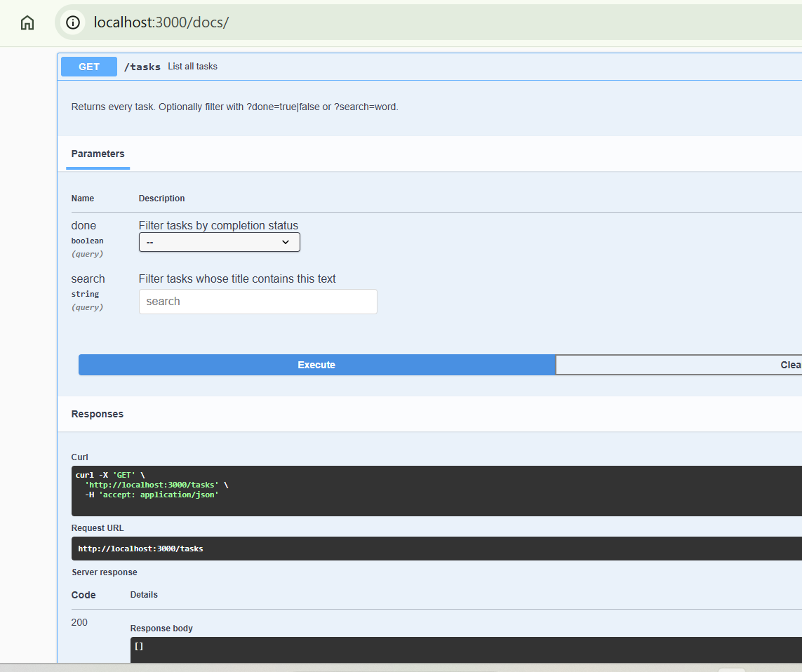

# Task API

A to-do list API built with Node.js and Express — full CRUD (Create, Read, Update, Delete) on tasks, with interactive documentation via Swagger UI.

This repo covers two stages of the same project:

| Version | Assignment | Storage | Status |
|---|---|---|---|
| **v1** | Week 2 · A1 — Build your first CRUD API | In-memory (JS array) | superseded |
| **v2** | Week 3 · A2 — Connecting your CRUD to the database | SQLite (`tasks.db`) | **current** |

Each task looks like this:

```json
{ "id": 1, "title": "Buy milk", "done": false }
```

---

## Tech stack

| Tool | Purpose |
|---|---|
| [Node.js](https://nodejs.org) | JavaScript runtime |
| [Express](https://expressjs.com) | Web framework — routing, JSON parsing |
| [swagger-ui-express](https://www.npmjs.com/package/swagger-ui-express) | Serves interactive API docs at `/docs` |
| [better-sqlite3](https://www.npmjs.com/package/better-sqlite3) | SQLite driver — added in v2 for persistent storage |

---

## Getting started

### Prerequisites
- Node.js 18+ installed (check with `node -v`)

### Install & run

```bash
git clone https://github.com/<your-username>/crud.git
cd crud
npm install
npm start
```

You should see:

```
Task API running at http://localhost:3000
```

Then open:
- **http://localhost:3000/** — API info
- **http://localhost:3000/docs** — interactive Swagger UI (try every endpoint without a terminal)
- **http://localhost:3000/** *(served from `public/index.html`)* — a small front-end console for the API

On first run, `npm start` also creates `tasks.db` automatically and seeds it with 3 example tasks — no manual database setup needed.

---

## Project structure

```
crud/
├── index.js           # server + all routes (now backed by SQLite in v2)
├── tasks.db            # SQLite database file — created automatically, git-ignored
├── openapi.json        # API spec that powers Swagger UI
├── public/
│   └── index.html       # small front-end console served at /
├── package.json        # dependencies & scripts
├── package-lock.json   # exact dependency versions
├── .gitignore          # excludes node_modules and tasks.db
└── README.md           # this file
```

---

## API reference

Identical in both v1 and v2 — this is the whole point of the v2 migration: same endpoints, same request/response shapes, only the storage underneath changed.

| Method | Endpoint       | Description                          | Success | Errors |
|--------|----------------|---------------------------------------|---------|--------|
| GET    | `/`            | API name, version, and endpoint list  | `200`   | —      |
| GET    | `/health`      | Liveness check                        | `200`   | —      |
| GET    | `/tasks`       | List all tasks                        | `200`   | —      |
| GET    | `/tasks/:id`   | Get a single task by id                | `200`   | `404` if not found |
| POST   | `/tasks`       | Create a task — body: `{ "title": string }` | `201` | `400` if title missing/empty |
| PUT    | `/tasks/:id`   | Update `title` and/or `done`           | `200`   | `400` invalid body · `404` not found |
| DELETE | `/tasks/:id`   | Delete a task                          | `204`   | `404` if not found |

**Status codes used:** `200` OK · `201` Created · `204` No Content · `400` Bad Request · `404` Not Found.

---

## Trying it out

### Option A — Swagger UI (easiest)
Go to `http://localhost:3000/docs`, expand any endpoint, click **Try it out**, fill in the fields, and hit **Execute**.

### Option B — terminal (PowerShell)

```powershell
# Get the full list
curl.exe -i http://localhost:3000/tasks

# Get one task
curl.exe -i http://localhost:3000/tasks/1

# Create a task
Invoke-RestMethod -Uri http://localhost:3000/tasks -Method Post -ContentType "application/json" -Body '{"title":"Buy milk"}'

# Update a task
Invoke-RestMethod -Uri http://localhost:3000/tasks/1 -Method Put -ContentType "application/json" -Body '{"done":true}'

# Delete a task
curl.exe -i -X DELETE http://localhost:3000/tasks/1
```

### Example: real request/response

```
GET http://localhost:3000/tasks/4

HTTP/1.1 200 OK
Content-Type: application/json; charset=utf-8

{
  "id": 4,
  "title": "complete assignment",
  "done": false
}
```

### Swagger UI


---

# v1 — In-memory CRUD (Week 2 · Assignment A1)

The original version of this project. Tasks are stored **in memory only** (a plain JavaScript array) — there is no database, so all data resets whenever the server restarts.

### The "mortality experiment"

Create a task, restart the server, then `GET /tasks` again — the new task is gone; only the 3 seed tasks remain.

This happens because `tasks` was just a variable in memory — nothing was written to disk. Fixing this is exactly what v2's SQLite database (below) is for.

### Development notes (v1 stages)

| Stage | What was added |
|-------|-----------------|
| 0 | Bare Express server, no routes |
| 1 | `GET /` and `GET /health` |
| 2 | In-memory task list + `GET /tasks`, `GET /tasks/:id` (with 404s) |
| 3 | `POST /tasks` with validation |
| 4 | `PUT /tasks/:id` and `DELETE /tasks/:id` — full CRUD complete |
| 5 | `openapi.json` + Swagger UI at `/docs` |
| 6 | README + public GitHub repo |

---

# v2 — SQLite-backed CRUD (Week 3 · Assignment A2)

Same API, same endpoints, same request/response shapes — but storage moved from an in-memory array to a real SQLite database, so data now survives a server restart.

### Why SQLite

SQLite is a lightweight, serverless SQL database stored as a single file. It requires no separate database server or additional setup — just the database file on disk — which makes it ideal for small projects, local development, and demos. Compared with the v1 in-memory approach, SQLite persists data across server restarts, so tasks survive shutdowns and crashes instead of vanishing when the process exits.

### Where the database lives

This project stores its data in a SQLite file named `tasks.db`. The file is created automatically the first time the server initializes the database. `tasks.db` is git-ignored, so every fresh clone of the repository starts with an empty database — the app then recreates the table and seeds it with 3 example tasks on that first run.

### Development notes (v2 stages)

| Stage | What was added |
|-------|-----------------|
| 0 | `tasks.db` created automatically; `tasks` table created if missing; 3 tasks seeded only when empty |
| 1 | `GET /tasks` and `GET /tasks/:id` now run real SQL queries against SQLite |
| 2 | `POST /tasks` now runs `INSERT INTO tasks` — data survives a restart for the first time |
| 3 | `PUT /tasks/:id` and `DELETE /tasks/:id` now run `UPDATE` / `DELETE` SQL statements |
| 4 | Explored the database directly in DB Browser for SQLite, running queries by hand |
| 5 | README updated with why-SQLite, DB Browser screenshots, and this documentation |

### Running the queries for `tasks.db` in DB Browser for SQLite

This walks through Stage 4: opening the live database file and running SQL by hand, then confirming the API reflects each change instantly — no restart, no syncing, one source of truth.

**1. `SELECT * FROM tasks;`** — the starting state: 5 tasks in the table.


**2. `SELECT * FROM tasks WHERE done = 1;`** — filtered to only the completed task.


**3. `SELECT COUNT(*) FROM tasks;`** — a quick count: 5 rows.


**4. `UPDATE tasks SET done = 1;`** — marks every task done (no `WHERE` clause, on purpose, to see the effect) — 5 rows affected.


**5. `DELETE FROM tasks WHERE done = 1;`** — since everything was just marked done, this deletes every row — 5 rows affected.



**6. `SELECT * FROM tasks;`** — confirms the table is now empty: 0 rows returned.



**7. Calling `GET /tasks` from the running API (via Swagger UI), with no server restart** — the response comes back `[]`, matching the empty table exactly. This is the actual checkpoint: the API and DB Browser are reading the same file, live.



---

## License

MIT — built for educational purposes.